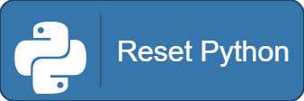

# Python

Python is a programming language, as well as an extension in CattyMod. This lets you run commands using [Pyodide](https://pyodide.org/en/stable/) which lets you run Python code online.

Check it out at https://cattymod.app/extensions/

If you are looking to learn it, check out the Python tutorial on [W3Schools](https://www.w3schools.com/python/). That will probably help you.

There are a few blocks that exist in this extension:

"Run Python" lets you run a singular command like you could if you open Python itself in your terminal.

"Run Python Script" lets you choose a Python script that you have created via the `Open Python Editor` button at the bottom of the extension. These can have multiple lines, unlike the other blocks.

"Last Python Response" lets you see the last thing that Python printed. This can be helpful for transfering data from Python to CattyMod.

"Python Ready?" lets you see if Python has finished loading yet. You can test this by checking the value of the boolean (which will be false) while you have "Reset Python" running.

"Install Python Package" lets you install a specific Python Package, such as `requests`. Using this block also builds up a package list stored in your `.sb3` file.

"Reset Python" lets you reset Python for whatever reason. This clears values like variables you set in Python. (for example `x = 5`)
